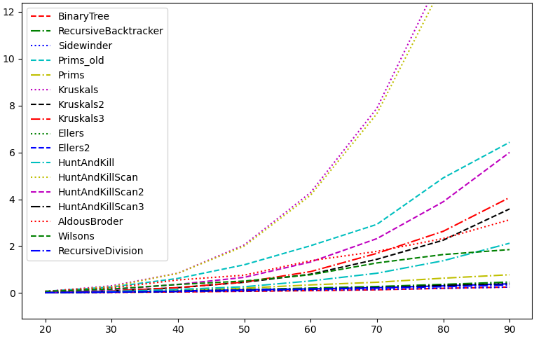

# Mods

## General note on folder

`mods/` is an archive, a collection of experiments:
- results of code optimisation, 
- other possible solutions to the topic,
- playing around with the language etc. 

## Algo optimisation

Document `maze_nng.py` implements a maze representation by *graph* using a pointer structure. Each *node* (class `Cell`) 
points to its neighbours. The *graph* is then constructed from these *nodes*. 

### Implemented algorithms
This document implements several algorithms for maze generation. Some of these algorithms can be implemented in 
various ways, e.g. using different Python data types. Such algos have been optimised to increase their speed, 
which becomes a benefit when the code is used to generate very large mazes. 

The following algos have only one implementation:
- Binary tree
- Sidewinder
- Recursive backtracker
- Aldous-Broder
- Wilson's
- Recursive division

Algos that have been optimised, i.e. implemented in various ways include:
- Prim's
- Kruskal's
- Eller's
- Hunt and kill

### Implementation details

#### Prim's

`Prims_oldMazeBuilder` and `PrimsMazeBuilder` differ only in the data type used to store the list of 
*frontier cells*[^1]. The first one declares this attribute as a list. 
```
frontier_cells: list[Cell] = []
```
The other one uses a set to store the information. 
```
frontier_cells: set[Cell] = set()
```

[^1]: The unvisited neighbours of already visited cells that can be chosen to carve into, 
i.e. to build the maze passage. 

#### Kruskal's

Kruskal's algorithm starts with each maze cell being in its own tree set. These tree sets get joined as 
the algorithm creates the passage of the maze, i.e. connects the cells. 

`KruskalsMazeBuilder` stores these tree sets in a list. 
```
tree_sets: list[set[Cell | None]] = [{cell} for cell in self.grid.get_next_cell()]
```
The problem with this implementation is that each time two cells are connected, i.e. two sets are joined, the algorithm 
has to look up the correct sets, which contain the cells. This is obviously very inefficient. 

`Kruskals2MazeBuilder` uses a dictionary, where the key is the cell and the value is the set the cell belongs to. 
```
tree_sets: dict[Cell, set[Cell]] = {cell: {cell} for cell in self.grid.get_next_cell()}
```
This implementation aims to reduce the complexity of the previous solution (lookup of the sets to be joined) to O(1). 
However, it necessitates an update of dict values to the new joined set for each key (cell) in that set.

`Kruskals3MazeBuilder` uses two dictionaries. 
```
set_id_of_cell: dict[Cell, int] = {}
cells_in_set: dict[int, list[Cell]] = {}
```
The first one provides for each cell (`dict` key) the ID of the set it belongs to. The second one stores the sets. 

#### Eller's

`EllersMazeBuilder` and `Ellers2MazeBuilder` are similarly to the Prim's algo implementations a comparison between 
the efficiency of python `list` and `set`, respectively. 

#### Hunt and kill

Hunt and kill algorithm is a modification of the Recursive backtracker algo. In comparison to the latter it should 
be more efficient. When a *random walk*[^2] ends, the algo does not backtrack, instead it selects an unvisited 
neighbour of the visited cells to continue with the next *random walk*. 

`HuntAndKillMazeBuilder` stores all the unvisited neighbours in a set. The algorithm picks from this set to continue 
the path carving, without the need to do backtracking. 

`HuntAndKillScanMazeBuilder` implements a version of the algorithm, where the unvisited neighbours are not memorised 
as in the previous case. When the *random walk* hits a dead-end the maze is scanned cell by cell, until an unvisited 
cell adjacent to a visited one is found. The algo then pics this cell to start the next *random walk*.

`HuntAndKillScan2MazeBuilder` is a simple modification. The previous version has a logical error - it checks every 
neighbour of each scanned cell to find an unvisited adjacent cell. This means, it might check already scanned cells, 
i.e. the same cells multiple times. This version only checks the left and right neighbours of the inspected cell. 

`HuntAndKillScan3MazeBuilder` is a modified version of the previous one. It memorises the uncompleted rows 
(rows with unvisited cells) to speed up the scan part of the algorithm. 
Therefore, it looks for unvisited cells only in these rows and does not return to fully carved rows. 

> **Warning** 
>*The last algorithm, `HuntAndKillScan3MazeBuilder`, contains a bug. Sometimes, the code does not finish building the maze. 
> In some cases the maze ends up generated with uncarved cells.*

[^2]: A random process that describes a path that consists of a succession of random steps. 
### Results

Comparison of runtime among the various algorithms can be seen in *Figure 1*[^3], and in 
detail the difference among the fastest algorithms is shown in *Figure 2*[^3]. 

In theory, ***Aldous-Broder*** and ***Wilson's*** algorithms should be the slowest ones. While the 
fastest algorithms are ***Binary tree*** and ***Sidewinder***. The reason behind the inefficiency of some algorithms 
over ***Aldous-Broder*** and ***Wilson's*** is implementation related. 
The optimisation took place to ensure this theoretical difference is met. 

<p align="center">
    
</p>

<p align="center"><strong> Figure 1:</strong> Comparison of all the implemented algos</p>

<p align="center">
    
</p>

<p align="center"><strong> Figure 2:</strong> Closer look at the fastest algos</p>

## Cython optimisation

Three versions of the same code have been used in the following comparison. 
- `maze_nng.py` is the pure Python version of the code, written and run in Python. 
- `maze_nng_py.pyx` is the pure Python implementation compiled into C code using Cython. 
- `maze_nng_cy.pyx` is the Cython implementation of the original Python code, using C data types. 

<p align="center">
    
</p>

<p align="center"><strong> Figure 3:</strong> Comparison of two algos - Python vs. Cython</p>

[^3]: x-axis is the length of side of a square maze, y-axis represents time of code execution 
(only for reference, HW dependent). 
